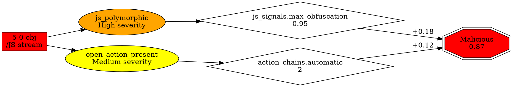

# ML Signals Plan - Explainability Review

**Date**: 2026-01-09
**Reviewer**: Claude
**Context**: Review of `plans/ml-signals.md` for explainability improvements

---

## Executive Summary

The ml-signals.md plan significantly expands ML capabilities (20 → 320+ features) and adds semantic enrichment to IR/ORG. While it includes basic explainability (per-object risk scores, attack surfaces, metadata), there are substantial opportunities to improve model interpretability for analysts.

**Key Recommendations**:
1. Add feature attribution for traditional ML (320+ features need explainability)
2. Implement decision path visualization showing feature → finding → risk progression
3. Generate human-readable natural language explanations
4. Add comparative and counterfactual explanations
5. Implement graph path explanations beyond per-node attribution
6. Calibrate and explain risk scores
7. Link explanations back to byte offsets for evidence validation

---

## Current State Analysis

### ✅ Existing Explainability Features

From `plans/ml-signals.md`:
- **Per-object risk scores** - Line 447, 673-674, 723-760
- **Attack surface categorization** - Line 241, 251-263, 446-447
- **Finding-level explanations** - Line 422-445
- **Rich metadata** (200+ fields) - Line 174-227
- **Document-level risk profiles** - Line 524-566, 918-961

From `plans/explainability.md` (Graph ML):
- **Per-node logits** for graph attribution
- **Top-K contributing nodes** in reports
- **IR object mapping** for node scores

### ⚠️ Identified Gaps

1. **No feature attribution for traditional ML** (320+ features)
2. **No decision path visualization** (how features combine to produce verdicts)
3. **No human-readable summaries** (analysts need natural language)
4. **No comparative explanations** ("why is this more suspicious than benign files?")
5. **No counterfactual explanations** ("what would make this benign?")
6. **No graph path explanations** (suspicious reference chains)
7. **No confidence calibration** (are risk scores accurate probabilities?)
8. **No feature interaction explanations** (which features interact to signal threats?)
9. **No temporal explanations** (how risk evolved through incremental updates)
10. **Limited evidence linking** (feature → byte offset mapping incomplete)

---

## Recommendations

### 1. Feature Attribution for Traditional ML (Priority: HIGH)

**Problem**: The plan expands from 20 to 320+ features across 14 categories. Without attribution, analysts can't understand which features drove the ML decision.

**Solution**: Add SHAP (SHapley Additive exPlanations) integration for traditional ML models.

**Implementation**:

```rust
// New structure for feature attributions
#[derive(Debug, Clone, Serialize, Deserialize)]
pub struct FeatureAttribution {
    pub feature_name: String,
    pub value: f32,
    pub contribution: f32,  // SHAP value or similar
    pub baseline: f32,      // Expected value for benign files
}

#[derive(Debug, Clone, Serialize, Deserialize)]
pub struct MlExplanation {
    pub prediction: f32,
    pub baseline_score: f32,
    pub top_positive_features: Vec<FeatureAttribution>,  // Top 10
    pub top_negative_features: Vec<FeatureAttribution>,  // Top 10
    pub feature_group_importance: HashMap<String, f32>,   // Per-category
}

pub fn explain_prediction(
    model: &TraditionalMlModel,
    features: &ExtendedFeatureVector,
    baseline: &ExtendedFeatureVector,  // Mean of benign training set
) -> MlExplanation {
    // Compute SHAP values or permutation importance
    // Return structured explanation
}
```

**Export Example**:
```json
{
  "prediction": 0.87,
  "baseline_score": 0.15,
  "explanation": {
    "top_positive_features": [
      {"name": "js_signals.max_obfuscation_score", "value": 0.95, "contribution": 0.18, "baseline": 0.0},
      {"name": "finding.js_polymorphic_count", "value": 3.0, "contribution": 0.15, "baseline": 0.0},
      {"name": "action_chains.automatic_trigger_count", "value": 2.0, "contribution": 0.12, "baseline": 0.0}
    ],
    "feature_group_importance": {
      "js_signals": 0.45,
      "action_chains": 0.22,
      "uri_signals": 0.18,
      "structural_anomalies": 0.08
    }
  }
}
```

**Integration Points**:
- Phase 1 (Extended Feature Vector) - Add attribution computation
- Phase 6 (Inference) - Generate explanations alongside predictions
- Reports - Add "Feature Attribution" section

**Dependencies**:
- Consider using `shap` Python library via PyO3 bindings, or
- Implement tree-based SHAP natively in Rust for Random Forest/XGBoost
- For neural networks, use Integrated Gradients

---

### 2. Decision Path Visualization (Priority: HIGH)

**Problem**: The plan creates a pipeline: detectors → findings → features → ML prediction. Analysts need to understand this causal chain.

**Solution**: Generate decision path diagrams showing how evidence flows through the system.

**Implementation**:

```rust
#[derive(Debug, Clone, Serialize, Deserialize)]
pub struct DecisionPath {
    pub stages: Vec<DecisionStage>,
}

#[derive(Debug, Clone, Serialize, Deserialize)]
pub struct DecisionStage {
    pub stage_type: StageType,
    pub items: Vec<DecisionItem>,
    pub risk_contribution: f32,
}

#[derive(Debug, Clone, Serialize, Deserialize)]
pub enum StageType {
    Evidence,      // Byte offsets in PDF
    Finding,       // Detector findings
    Feature,       // Aggregated features
    Prediction,    // ML output
}

#[derive(Debug, Clone, Serialize, Deserialize)]
pub struct DecisionItem {
    pub name: String,
    pub value: String,
    pub importance: f32,
    pub links_to: Vec<String>,  // References to items in next stage
}

pub fn build_decision_path(
    evidence: &[EvidenceSpan],
    findings: &[Finding],
    features: &ExtendedFeatureVector,
    attribution: &MlExplanation,
) -> DecisionPath {
    // Trace backwards from prediction to evidence
    // Show causal chain
}
```

**Visualization Example** (DOT format for GraphViz):


**Export**:
```bash
sis explain-prediction malicious.pdf --ml --path decision_path.dot
```

---

### 3. Human-Readable Natural Language Summaries (Priority: HIGH)

**Problem**: Risk profiles are structured JSON. Analysts need quick natural language summaries.

**Solution**: Generate templated natural language explanations based on top findings and features.

**Implementation**:

```rust
pub fn generate_explanation_text(
    prediction: f32,
    risk_profile: &DocumentRiskProfile,
    top_findings: &[Finding],
    attribution: &MlExplanation,
) -> String {
    let severity_level = if prediction > 0.8 { "highly" }
                        else if prediction > 0.6 { "moderately" }
                        else { "somewhat" };

    let mut summary = format!(
        "This PDF is {} suspicious (risk score: {:.2}). ",
        severity_level, prediction
    );

    // Primary threat vector
    if let Some(top_feature) = attribution.top_positive_features.first() {
        summary.push_str(&format!(
            "The strongest indicator is {} (contribution: +{:.2}). ",
            humanize_feature_name(&top_feature.feature_name),
            top_feature.contribution
        ));
    }

    // Finding summary
    let high_findings: Vec<_> = top_findings.iter()
        .filter(|f| f.severity == Severity::High)
        .collect();

    if !high_findings.is_empty() {
        summary.push_str(&format!(
            "Found {} high-severity issues including: ",
            high_findings.len()
        ));

        for (i, f) in high_findings.iter().take(3).enumerate() {
            if i > 0 { summary.push_str(", "); }
            summary.push_str(&humanize_finding_kind(&f.kind));
        }
        summary.push_str(". ");
    }

    // Attack pattern
    if risk_profile.js_risk.present && risk_profile.supply_chain_risk.multi_stage_chain {
        summary.push_str("This appears to be a multi-stage attack with obfuscated JavaScript. ");
    } else if risk_profile.js_risk.present {
        summary.push_str("JavaScript code was detected. ");
    }

    // Recommended action
    if prediction > 0.8 {
        summary.push_str("Recommend: Block and investigate in sandbox.");
    } else if prediction > 0.6 {
        summary.push_str("Recommend: Flag for manual review.");
    } else {
        summary.push_str("Recommend: Monitor or allow with caution.");
    }

    summary
}

fn humanize_feature_name(name: &str) -> String {
    match name {
        "js_signals.max_obfuscation_score" => "highly obfuscated JavaScript",
        "finding.js_polymorphic_count" => "polymorphic JavaScript patterns",
        "action_chains.automatic_trigger_count" => "automatic action triggers",
        // ... map all 320 features to human-readable descriptions
        _ => name.replace("_", " ")
    }
}
```

**Example Output**:
```text
This PDF is highly suspicious (risk score: 0.87). The strongest indicator is
highly obfuscated JavaScript (contribution: +0.18). Found 3 high-severity
issues including: polymorphic JavaScript, automatic OpenAction trigger, and
hidden URI with IP address. This appears to be a multi-stage attack with
obfuscated JavaScript. Recommend: Block and investigate in sandbox.
```

**Integration**:
- Add to `--json` output as `explanation_text` field
- Add to report as "Summary" section
- Add to CLI output for quick triage

---

### 4. Comparative Explanations (Priority: MEDIUM)

**Problem**: "Why is this file suspicious?" is clearer when contrasted with "What do benign files look like?"

**Solution**: Compare features against benign baseline distribution.

**Implementation**:

```rust
#[derive(Debug, Clone, Serialize, Deserialize)]
pub struct BenignBaseline {
    pub feature_means: HashMap<String, f32>,
    pub feature_stddevs: HashMap<String, f32>,
    pub feature_percentiles: HashMap<String, Vec<f32>>,  // P10, P25, P50, P75, P90
}

pub fn compute_comparative_explanation(
    features: &ExtendedFeatureVector,
    baseline: &BenignBaseline,
) -> Vec<ComparativeFeature> {
    let mut comparisons = Vec::new();

    for (name, value) in features.to_named_map() {
        let mean = baseline.feature_means.get(&name).copied().unwrap_or(0.0);
        let stddev = baseline.feature_stddevs.get(&name).copied().unwrap_or(1.0);
        let z_score = (value - mean) / stddev;

        if z_score.abs() > 2.0 {  // More than 2 standard deviations
            comparisons.push(ComparativeFeature {
                name,
                value,
                benign_mean: mean,
                z_score,
                interpretation: if z_score > 0.0 {
                    format!("{:.1}σ higher than typical benign files", z_score)
                } else {
                    format!("{:.1}σ lower than typical benign files", z_score.abs())
                }
            });
        }
    }

    comparisons.sort_by(|a, b| b.z_score.abs().partial_cmp(&a.z_score.abs()).unwrap());
    comparisons
}
```

**Example Output**:
```json
{
  "comparative_analysis": [
    {
      "feature": "js_signals.max_obfuscation_score",
      "value": 0.95,
      "benign_mean": 0.0,
      "z_score": 47.5,
      "interpretation": "47.5σ higher than typical benign files",
      "note": "This is extremely unusual"
    },
    {
      "feature": "finding.js_polymorphic_count",
      "value": 3.0,
      "benign_mean": 0.05,
      "z_score": 14.2,
      "interpretation": "14.2σ higher than typical benign files"
    }
  ]
}
```

---

### 5. Counterfactual Explanations (Priority: MEDIUM)

**Problem**: Analysts want to know: "What would need to change for this to be benign?"

**Solution**: Find minimal feature changes that would flip the prediction.

**Implementation**:

```rust
#[derive(Debug, Clone, Serialize, Deserialize)]
pub struct CounterfactualExplanation {
    pub current_prediction: f32,
    pub threshold: f32,
    pub counterfactual_prediction: f32,
    pub changes_needed: Vec<FeatureChange>,
    pub plausibility: f32,  // 0-1, how realistic are these changes?
}

#[derive(Debug, Clone, Serialize, Deserialize)]
pub struct FeatureChange {
    pub feature: String,
    pub current_value: f32,
    pub counterfactual_value: f32,
    pub interpretation: String,
}

pub fn generate_counterfactual(
    model: &TraditionalMlModel,
    features: &ExtendedFeatureVector,
    threshold: f32,
) -> CounterfactualExplanation {
    // Use gradient-based search or genetic algorithm to find minimal changes
    // that would push prediction below threshold

    // Prefer changes to high-attribution features
    // Enforce constraints (e.g., counts must be non-negative)
    // Return smallest set of plausible changes
}
```

**Example Output**:
```json
{
  "counterfactual": {
    "current_prediction": 0.87,
    "threshold": 0.5,
    "counterfactual_prediction": 0.48,
    "changes_needed": [
      {
        "feature": "js_signals.max_obfuscation_score",
        "current": 0.95,
        "counterfactual": 0.3,
        "interpretation": "Reduce JavaScript obfuscation from very high to low"
      },
      {
        "feature": "action_chains.automatic_trigger_count",
        "current": 2.0,
        "counterfactual": 0.0,
        "interpretation": "Remove automatic action triggers"
      }
    ],
    "plausibility": 0.6,
    "summary": "This file would be classified as benign if JavaScript obfuscation was reduced and automatic action triggers were removed."
  }
}
```

---

### 6. Graph Path Explanations (Priority: HIGH)

**Problem**: The existing explainability.md focuses on per-node attribution. But suspicious *paths* through the graph (Catalog → OpenAction → JS → URI) are often more informative than individual nodes.

**Solution**: Extend graph explanations to include suspicious paths.

**Implementation**:

```rust
#[derive(Debug, Clone, Serialize, Deserialize)]
pub struct GraphPathExplanation {
    pub suspicious_paths: Vec<SuspiciousPath>,
    pub max_path_risk: f32,
    pub avg_path_risk: f32,
}

#[derive(Debug, Clone, Serialize, Deserialize)]
pub struct SuspiciousPath {
    pub path: Vec<PathNode>,
    pub risk_score: f32,
    pub explanation: String,
    pub attack_pattern: Option<String>,  // "multi_stage_js", "automatic_uri", etc.
}

#[derive(Debug, Clone, Serialize, Deserialize)]
pub struct PathNode {
    pub obj_ref: (u32, u16),
    pub node_type: String,
    pub edge_to_next: Option<EdgeInfo>,
}

#[derive(Debug, Clone, Serialize, Deserialize)]
pub struct EdgeInfo {
    pub edge_type: String,
    pub key: String,
    pub suspicious: bool,
}

pub fn extract_suspicious_paths(
    typed_graph: &TypedGraph,
    node_scores: &[f32],
    findings: &[Finding],
) -> GraphPathExplanation {
    // Find all paths from Catalog to high-scoring nodes
    // Score paths by: sum of node scores + edge suspiciousness
    // Classify paths by attack pattern
    // Return top-K most suspicious paths
}
```

**Example Output**:
```json
{
  "graph_path_explanation": {
    "suspicious_paths": [
      {
        "path": [
          {"obj_ref": [1, 0], "node_type": "Catalog", "edge": {"type": "OpenAction", "key": "/OpenAction", "suspicious": true}},
          {"obj_ref": [5, 0], "node_type": "Action", "edge": {"type": "JavaScriptPayload", "key": "/JS", "suspicious": true}},
          {"obj_ref": [10, 0], "node_type": "Stream", "edge": null}
        ],
        "risk_score": 0.93,
        "explanation": "Automatic JavaScript execution via OpenAction",
        "attack_pattern": "automatic_js_trigger"
      },
      {
        "path": [
          {"obj_ref": [5, 0], "node_type": "Action", "edge": {"type": "UriTarget", "key": "/URI", "suspicious": true}},
          {"obj_ref": [12, 0], "node_type": "String", "edge": null}
        ],
        "risk_score": 0.81,
        "explanation": "JavaScript triggers external URI",
        "attack_pattern": "js_to_external_resource"
      }
    ],
    "max_path_risk": 0.93,
    "avg_path_risk": 0.72
  }
}
```

**Integration with Existing Plan**:
- Builds on TypedGraph and PathFinder from graph-integration-first
- Complements per-node logits from explainability.md
- Adds to Phase 3 (Enhanced ORG) and Phase 6 (Inference)

---

### 7. Risk Score Calibration & Confidence Intervals (Priority: MEDIUM)

**Problem**: Risk scores (0-1) should represent actual probabilities. A 0.8 score should mean "80% chance of being malicious". Many models are poorly calibrated.

**Solution**: Add calibration curves and confidence intervals.

**Implementation**:

```rust
#[derive(Debug, Clone, Serialize, Deserialize)]
pub struct CalibratedPrediction {
    pub raw_score: f32,
    pub calibrated_score: f32,
    pub confidence_interval: (f32, f32),  // 95% CI
    pub calibration_method: String,       // "platt_scaling", "isotonic", etc.
}

pub fn calibrate_prediction(
    raw_score: f32,
    calibrator: &CalibrationModel,
) -> CalibratedPrediction {
    // Apply calibration curve (e.g., Platt scaling)
    // Compute confidence interval via bootstrap or model uncertainty
}

// Training-side: fit calibration model on validation set
pub fn train_calibrator(
    predictions: &[f32],
    ground_truth: &[bool],
) -> CalibrationModel {
    // Fit isotonic regression or Platt scaling
    // Store calibration curve
}
```

**Visualization**:
Generate calibration curves showing predicted probability vs. observed frequency.

**Report Integration**:
```json
{
  "prediction": {
    "raw_score": 0.87,
    "calibrated_score": 0.76,
    "confidence_interval": [0.68, 0.84],
    "interpretation": "76% probability of being malicious (68%-84% with 95% confidence)"
  }
}
```

---

### 8. Evidence Linking & Byte-Level Traceability (Priority: HIGH)

**Problem**: Features and findings should link back to exact byte offsets in the PDF for verification.

**Solution**: Maintain evidence chains throughout the pipeline.

**Implementation**:

```rust
#[derive(Debug, Clone, Serialize, Deserialize)]
pub struct EvidenceChain {
    pub feature_name: String,
    pub feature_value: f32,
    pub derived_from_findings: Vec<String>,  // Finding IDs
    pub evidence_spans: Vec<EvidenceSpan>,   // Byte offsets
}

pub fn build_evidence_chains(
    features: &ExtendedFeatureVector,
    findings: &[Finding],
) -> Vec<EvidenceChain> {
    // For each feature, trace back to contributing findings
    // Collect all evidence spans from those findings
    // Return full evidence chain
}
```

**Example**:
```json
{
  "feature": "js_signals.max_obfuscation_score",
  "value": 0.95,
  "derived_from_findings": ["finding_123", "finding_456"],
  "evidence": [
    {"span": {"start": 1234, "end": 5678}, "preview": "String.fromCharCode(97,112,112,...)"},
    {"span": {"start": 6789, "end": 7890}, "preview": "eval(unescape('%75%6E%65%73%63'))"}
  ]
}
```

**Report Integration**:
- Hyperlink features to findings
- Hyperlink findings to byte offsets
- Enable "jump to evidence" in UI/CLI

---

### 9. Feature Interaction Explanations (Priority: LOW)

**Problem**: Some threats only appear when multiple features combine (e.g., "JS + automatic trigger + hidden URI" = phishing).

**Solution**: Detect and explain feature interactions.

**Implementation**:

```rust
#[derive(Debug, Clone, Serialize, Deserialize)]
pub struct FeatureInteraction {
    pub features: Vec<String>,
    pub interaction_strength: f32,
    pub interpretation: String,
    pub attack_pattern: Option<String>,
}

pub fn detect_interactions(
    features: &ExtendedFeatureVector,
    interaction_rules: &[InteractionRule],
) -> Vec<FeatureInteraction> {
    // Check predefined interaction rules
    // E.g., "js_present && automatic_trigger && uri_hidden => phishing_pattern"
    // Return detected interactions with explanations
}
```

**Example**:
```json
{
  "interactions": [
    {
      "features": ["js_present", "action_chains.automatic_trigger_count", "uri_signals.hidden_annotation_count"],
      "strength": 0.85,
      "interpretation": "Automatic JavaScript execution combined with hidden URIs",
      "attack_pattern": "phishing_with_evasion"
    }
  ]
}
```

---

### 10. Temporal Explanations for Incremental Updates (Priority: LOW)

**Problem**: PDFs with incremental updates may show risk evolution over versions. Understanding how risk changed is valuable.

**Solution**: Track risk across incremental updates.

**Implementation**:

```rust
#[derive(Debug, Clone, Serialize, Deserialize)]
pub struct TemporalExplanation {
    pub versions: Vec<VersionRisk>,
    pub risk_trend: String,  // "increasing", "stable", "decreasing"
    pub suspicious_updates: Vec<usize>,  // Version indices
}

#[derive(Debug, Clone, Serialize, Deserialize)]
pub struct VersionRisk {
    pub version: usize,
    pub risk_score: f32,
    pub new_findings: Vec<String>,
    pub explanation: String,
}

pub fn analyze_temporal_risk(
    incremental_updates: &[IncrementalUpdate],
    findings_by_version: &[Vec<Finding>],
) -> TemporalExplanation {
    // Compute risk for each version
    // Identify which updates introduced suspiciousness
    // Generate narrative
}
```

**Example**:
```text
Version 1: Clean (risk: 0.05)
Version 2: Clean (risk: 0.08)
Version 3: Suspicious (risk: 0.72) - Added obfuscated JavaScript and OpenAction
Version 4: Highly Suspicious (risk: 0.91) - Added hidden URI with IP address

Interpretation: Document became suspicious in version 3 when JavaScript
was added. Risk increased further in version 4 when external communication
capability was added. This pattern suggests deliberate weaponization.
```

---

## Implementation Priorities

### Phase 1 (MVP - Required for interpretability)
1. ✅ **Feature Attribution** (Traditional ML) - SHAP/permutation importance
2. ✅ **Human-Readable Summaries** - Natural language explanation generation
3. ✅ **Evidence Linking** - Feature → Finding → Byte offset chains
4. ✅ **Graph Path Explanations** - Suspicious paths beyond per-node scores

### Phase 2 (Enhanced explanations)
5. **Decision Path Visualization** - GraphViz diagrams
6. **Comparative Explanations** - vs. benign baseline
7. **Risk Score Calibration** - Confidence intervals

### Phase 3 (Advanced)
8. **Counterfactual Explanations** - What-if analysis
9. **Feature Interactions** - Combination pattern detection
10. **Temporal Explanations** - Risk evolution tracking

---

## Integration with Existing Plans

### With `plans/ml-signals.md`:

**Phase 1 (Extended Feature Vector)**:
- Add `FeatureAttribution` struct
- Implement `explain_features()` function
- Export attribution with feature vectors

**Phase 2 (Enhanced IR)**:
- Link findings to evidence spans
- Add `evidence_chain` field to findings

**Phase 3 (Enhanced ORG)**:
- Add `suspicious_paths` to ORG export
- Link paths to attack patterns

**Phase 6 (Inference)**:
- Generate explanations alongside predictions
- Add `--explain` flag to ML commands

### With `plans/explainability.md`:

**Complement per-node logits**:
- Add graph path extraction on top of node scores
- Link node scores to features (node → finding → feature → attribution)

**Report enhancements**:
- Add "Feature Attribution" section for traditional ML
- Add "Suspicious Paths" section for graph ML
- Add "Natural Language Summary" at top

---

## Export Format Examples

### Comprehensive Explanation Export

```bash
sis scan malicious.pdf --ml --explain --json -o explanation.json
```

```json
{
  "file": "malicious.pdf",
  "prediction": {
    "model": "traditional_ml",
    "raw_score": 0.87,
    "calibrated_score": 0.76,
    "confidence_interval": [0.68, 0.84],
    "label": "malicious",
    "threshold": 0.5
  },
  "explanation": {
    "summary": "This PDF is highly suspicious (risk score: 0.87). The strongest indicator is highly obfuscated JavaScript (contribution: +0.18). Found 3 high-severity issues including: polymorphic JavaScript, automatic OpenAction trigger, and hidden URI with IP address. This appears to be a multi-stage attack with obfuscated JavaScript. Recommend: Block and investigate in sandbox.",

    "feature_attribution": {
      "top_positive": [
        {"feature": "js_signals.max_obfuscation_score", "value": 0.95, "contribution": 0.18, "baseline": 0.0},
        {"feature": "finding.js_polymorphic_count", "value": 3.0, "contribution": 0.15, "baseline": 0.0},
        {"feature": "action_chains.automatic_trigger_count", "value": 2.0, "contribution": 0.12, "baseline": 0.0}
      ],
      "feature_group_importance": {
        "js_signals": 0.45,
        "action_chains": 0.22,
        "uri_signals": 0.18
      }
    },

    "comparative_analysis": [
      {"feature": "js_signals.max_obfuscation_score", "z_score": 47.5, "interpretation": "47.5σ higher than benign"}
    ],

    "evidence_chains": [
      {
        "feature": "js_signals.max_obfuscation_score",
        "findings": ["js_polymorphic_f123"],
        "evidence": [{"span": {"start": 1234, "end": 5678}, "preview": "String.fromCharCode(...)"}]
      }
    ],

    "counterfactual": {
      "changes_needed": [
        {"feature": "js_signals.max_obfuscation_score", "current": 0.95, "counterfactual": 0.3}
      ],
      "summary": "Would be benign if JavaScript obfuscation was reduced"
    }
  }
}
```

---

## Testing & Validation

### Explanation Quality Metrics

1. **Faithfulness**: Do explanations accurately reflect model behavior?
   - Test: Perturb features according to explanation, verify prediction changes as expected

2. **Stability**: Do similar inputs produce similar explanations?
   - Test: Add noise to features, check explanation consistency

3. **Comprehensiveness**: Do explanations cover all major factors?
   - Test: Check that top-K features account for >80% of prediction

4. **Human Evaluation**: Do analysts find explanations useful?
   - Test: User study with security analysts

### Unit Tests

```rust
#[test]
fn test_feature_attribution_sums_to_prediction() {
    let attribution = explain_prediction(&model, &features, &baseline);
    let sum: f32 = attribution.top_positive_features.iter()
        .map(|f| f.contribution)
        .sum();
    assert!((sum - (prediction - baseline)).abs() < 0.01);
}

#[test]
fn test_evidence_chain_completeness() {
    let chains = build_evidence_chains(&features, &findings);
    for chain in chains {
        assert!(!chain.evidence_spans.is_empty(),
                "Feature {} has no evidence", chain.feature_name);
    }
}

#[test]
fn test_counterfactual_plausibility() {
    let cf = generate_counterfactual(&model, &features, 0.5);
    assert!(cf.plausibility > 0.0 && cf.plausibility <= 1.0);
    assert!(cf.counterfactual_prediction < 0.5);
}
```

---

## Documentation Updates

### New Sections Needed

**`docs/explainability.md`** (expand existing):
- Feature attribution methods
- Graph path explanations
- Natural language generation
- Calibration procedures

**`docs/modeling.md`**:
- Add "Interpretability" section
- Document explanation export formats
- Add usage examples

**`USAGE.md`**:
- Add `--explain` flag documentation
- Add explanation export examples

---

## Risks & Mitigations

| Risk | Impact | Mitigation |
|------|--------|------------|
| Feature attribution adds latency | Medium | Make explanations opt-in with `--explain` flag |
| SHAP values may be incorrect for complex models | High | Validate against simpler models, provide confidence bounds |
| Natural language summaries may be misleading | High | Template carefully, include disclaimers, enable manual review |
| Evidence chains may break with new detectors | Medium | Enforce evidence tracking in detector interface |
| Graph path extraction is computationally expensive | Low | Cache paths, limit to top-K |

---

## Success Criteria

### Quantitative
- **Explanation Coverage**: >90% of predictions have explanations with ≥3 features
- **Evidence Linking**: >95% of features link to evidence spans
- **Performance**: Explanation generation adds <20% overhead
- **Calibration**: Calibration error <0.05 on validation set

### Qualitative
- Analysts can answer "Why is this file suspicious?" in <30 seconds
- Explanations reduce false positive investigation time by >30%
- Inter-analyst agreement on threat severity increases with explanations

---

## Conclusion

The ml-signals.md plan significantly improves detection capabilities but needs parallel explainability enhancements to be operationally useful. The recommendations above provide a comprehensive framework for making ML predictions interpretable, traceable, and actionable for security analysts.

**Key additions**:
1. Feature attribution (SHAP) for 320+ features
2. Natural language summaries for fast triage
3. Graph path explanations beyond per-node scores
4. Evidence linking from features to byte offsets
5. Comparative and counterfactual explanations
6. Risk score calibration

Implementing Phase 1 recommendations (feature attribution, summaries, evidence linking, graph paths) should be considered **required** for the ml-signals plan, not optional enhancements. Without explainability, even highly accurate ML models have limited operational value in security contexts where analysts must justify decisions and investigate false positives.
